# Grabber Machine
 
*This program are be made for a custom grabber machine, driven by a Arduino board.*

## Hardware
**Actually the machine are not fully assembled yet, but for idea we have :**
- The frame
- 1 Push button
- 2 Axis driven by a stepper motor (*x, y*) with one limit switch per axis (*xls, yls*)
- 1 Axis driven by a DC motor (*z*)
- 1 Grabber driven by a servo motor (*rz*)

 ## Software flowchart
 
